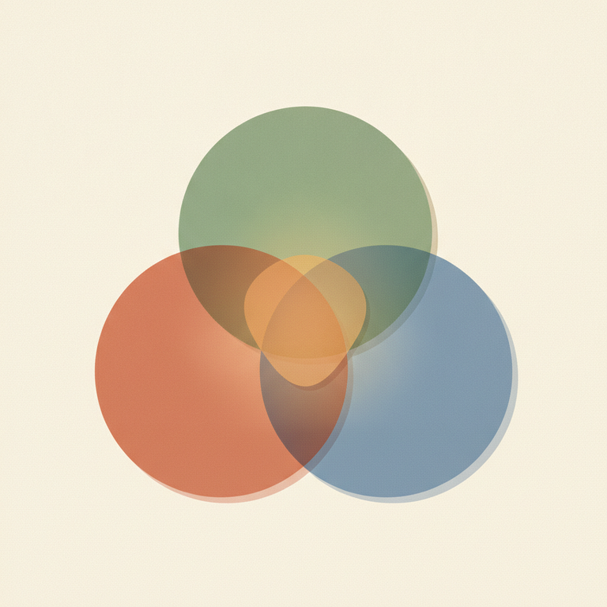
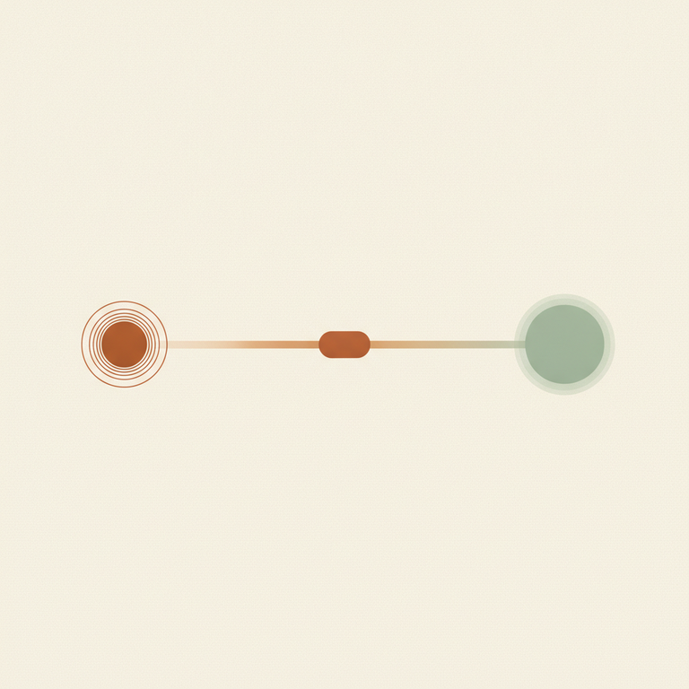

# 3. Théorie du champ / Organisme – environnement.

## Un organisme dans un environnement

La définition la plus simple donnée en formation tient en une phrase : **« Le Champ, c'est ce qui se passe autour de vous et en vous »**, dans l'interaction entre vous et votre environnement. Ou, formulée autrement au Jour 2 du premier week-end : **« un organisme dans un environnement »**, en interaction permanente — une influence à double sens, de l'environnement vers nous, et de nous vers l'environnement.

Cette phrase, en apparence toute simple, porte en elle un renversement de perspective important. On a spontanément tendance à penser « moi » d'un côté et « le monde » de l'autre, comme deux blocs séparés qui, parfois, se rencontrent. La théorie du champ dit l'inverse : il n'y a jamais de « moi » observable indépendamment de son environnement. Ce que nous sommes, ce que nous ressentons, ce que nous choisissons, tout cela n'existe que **dans** la relation à ce qui nous entoure — jamais en dehors.

## Kurt Lewin : le champ comme espace de vie

Ce cadre théorique n'est pas né avec la Gestalt-thérapie : il vient du psychologue **Kurt Lewin**, figure de l'école de la Gestalt-théorie (la psychologie de la forme, en Allemagne dans les années 1920-30), qui a développé entre 1935 et 1938 ce qu'il a appelé la **psychologie topologique et vectorielle**. Lewin affirme l'**impossibilité de décrire un comportement humain indépendamment de son milieu** : un individu évolue dans un « espace de vie » où il perçoit différents lieux, ressent des attractions et des répulsions comparables à des champs de force physiques, et décide d'aller dans telle ou telle direction. Point essentiel : l'angle est **phénoménologique** — le champ dont il est question n'est pas le monde objectif mesurable de l'extérieur, mais **le champ tel qu'il est éprouvé par la personne elle-même**.

Perls, Hefferline et Goodman reprennent cette intuition dans le texte fondateur *Gestalt Therapy* (1951) et l'appliquent à la clinique : ils y introduisent le concept de **« champ organisme-environnement »**, où l'organisme et son environnement « ne peuvent être séparés, étant les parties d'une même unité, le champ holistique ». Autrement dit, la Gestalt ne soigne pas un individu isolé de son contexte : elle travaille toujours la relation vivante entre la personne et ce qui l'entoure.

Un point mérite d'être bien retenu : **le champ n'existe pas de façon permanente en tant qu'entité figée**. Il s'actualise, se modifie sans cesse, en fonction de l'évolution des éléments qui composent la situation présente — les personnes en présence, le lieu, l'histoire récente, les besoins de chacun. C'est un champ vivant, mouvant, jamais figé une fois pour toutes.

> ⚠️ Piège QCM : le champ n'est **pas** un synonyme de « l'environnement extérieur » pris seul. Il désigne la relation, l'interaction constante entre l'organisme et son environnement — retirer l'un des deux pôles fait disparaître le champ lui-même.

## Figure et fond : comment le champ s'organise

Comment se manifeste concrètement ce champ dans l'expérience ? Par le jeu de la **figure et du fond**. À chaque instant, un élément du champ se détache en avant-plan de notre conscience — la figure — pendant que tout le reste demeure en arrière-plan, comme fond. Le texte fondateur de la Gestalt, *Gestalt Therapy* (Perls, Hefferline, Goodman, 1951), précise que ce processus est profondément **dynamique** : les besoins et les ressources du champ prêtent progressivement leurs forces à l'élaboration d'une figure dominante, qui capte l'attention tant qu'elle n'est pas résolue, avant de s'effacer pour laisser émerger la suivante.

Ce même texte donne un critère clinique précieux : « lorsque la figure est obscure, confuse, dépourvue de grâce et d'énergie, on peut être certain qu'il y a un manque de contact, un blocage, qu'un besoin organique vital n'est pas exprimé ». Une figure claire et vive, au contraire, signe un contact vivant avec le champ.

En formation, cette dynamique a été illustrée par une image simple et très concrète : « je me rappelle de l'Aurore lorsqu'il y a des nuages ». Même quand un problème (les nuages) s'impose en figure et occupe toute l'attention, la conscience peut maintenir l'existence des ressources (l'aurore) en fond — sans les nier, sans les oublier. C'est une manière de ne pas laisser une seule figure envahir tout le champ.

## La métavision : prendre de la hauteur sur le champ

Pour devenir capable de percevoir le champ dans son ensemble — et pas seulement la figure du moment — la formation propose l'image de la **métavision**, incarnée par la métaphore de l'**hélicoptère** : prendre de la hauteur sur la situation présente pour observer, depuis un point de vue plus large, ce qui se joue réellement dans l'interaction avec l'environnement. Ce mouvement de recul conscient permet d'« éclairer nos choix », c'est-à-dire de sortir du réflexe immédiat pour voir la situation dans son contexte élargi.

## La boîte de transformation : un outil pour gérer le champ

Un outil pratique d'hygiène thérapeutique découle directement de cette logique : la **boîte de transformation**. Le principe : visualiser une boîte et y déposer délibérément un élément perturbateur qui occupe le champ à un moment où ce n'est ni le lieu ni le moment d'y penser — non pas pour le nier ou le refouler, mais avec l'intention consciente d'y revenir plus tard. C'est une façon très concrète d'empêcher qu'une figure parasite reste active et envahisse tout le champ présent, sans pour autant faire comme si elle n'existait pas.

## Le champ appliqué : les trois pôles du bonheur

La théorie du champ n'est pas qu'une abstraction théorique : elle structure directement la manière dont la formation aborde une question aussi concrète que le bonheur. Le schéma présenté en formation relie trois pôles — le **travail et les passions**, les **relations**, et l'**environnement** qui les englobe tous les deux. Le message est clair : on ne peut définir le bonheur en ne regardant que l'intérieur de la personne (ses pensées, ses envies) ; il se joue tout autant dans la qualité du champ dans lequel elle vit. D'où cette formule retenue en formation : **« le bonheur, c'est une belle relation avec soi-même et avec les autres »** — jamais l'un sans l'autre.

*Le bonheur ne se pense pas en dehors du champ : il se joue à l'articulation entre soi, l'autre et l'environnement.*

## Le continuum limites / idéal

Un autre repère utile pour se situer dans son propre champ est le **continuum limites–idéal**. À une extrémité, les **limites** : le principe de réalité (l'âge, la situation présente, la société, les lois, mais aussi les croyances que l'on se donne, avec ou sans conscience). À l'autre extrémité, l'**idéal** : le champ des possibles, où tout est potentiellement envisageable — essayer des choses nouvelles, remettre en question ses croyances, se confronter à ses peurs pour ouvrir l'espace de ce qui est vivable.

*Se situer sur ce continuum aide à distinguer une limite réelle (le corps, par exemple) d'une limite uniquement crue.*

La toute première limite, rappelle la formation, c'est **notre corps** : nier le principe de réalité, c'est vouloir « ça, tout de suite », sans tenir compte de ce que le champ permet réellement à cet instant.

> ⚠️ Piège QCM : ne pas confondre le pôle « idéal » du continuum avec de la toute-puissance. La formation est explicite sur ce point : « on ne peut pas tout choisir ». Travailler le pôle idéal, c'est élargir le champ des possibles perçus — pas nier les limites réelles du champ (le corps, la réalité extérieure).

## Le champ, la verticalité et l'horizontalité

La théorie du champ éclaire aussi une image travaillée lors du module sur le stress : l'**axe de verticalité et d'horizontalité**. L'axe vertical représente le contact avec soi-même (l'ancrage, comme un arbre relié à la terre et ouvert vers le ciel) ; l'axe horizontal représente le contact avec l'autre et avec l'environnement. Un axe vertical bien nourri — par le contact avec sa propre matière, ses besoins, ses valeurs, ses limites — permet de rester présent et de qualité dans l'axe horizontal, c'est-à-dire dans la relation avec le champ extérieur. Un temps de retrait permet précisément de revenir nourrir sa verticalité avant de retourner au contact du champ.

## Le champ, matrice des stresseurs

Le regard gestaltiste sur le stress s'appuie directement sur cette logique de champ. La formation distingue le **stresseur** — un événement, une personne, une situation du champ, perçue comme une agression — du **stress**, qui est la réponse vécue en nous. Cette distinction n'est possible que parce qu'on pense stresseur et stress comme deux pôles d'un même champ organisme-environnement, jamais isolément.

La typologie des stresseurs travaillée en formation illustre bien cette idée : vie professionnelle (pression de résultats, climat, hiérarchie), vie affective (conjoint, enfants), problèmes matériels (argent, transports), données existentielles (maladie, finitude, perte). Tous ces éléments appartiennent à l'environnement du champ ; mais c'est la façon dont l'organisme les reçoit et y répond qui constitue le stress lui-même. D'où cette formule forte retenue en formation : **« Je suis responsable de mon état, les stresseurs ne sont pas responsables de mon état intérieur »** — sans nier pour autant la réalité de ce qui, dans le champ, vient nous solliciter.

Le philosophe **Sénèque** est cité en formation pour résumer cette posture : *« La vie ce n'est pas d'attendre que l'orage passe mais d'apprendre à danser sous la pluie. »* Une invitation à rester en mouvement dans son champ plutôt qu'à en attendre passivement la modification.

## Exemple vécu en formation : les deux camemberts

Un exercice pratique du module « Vivre » illustre concrètement le travail sur le champ : les **« deux camemberts »**. Le client dessine deux cercles représentant son état, revient au corps, parle de son projet, réfléchit à ce qui, dans son environnement réel (horaires, habitudes), pourrait faire baisser son niveau de stress. Le praticien, de son côté, travaille sa propre verticalité pour proposer un accompagnement stable — car le champ thérapeutique inclut aussi le praticien lui-même, avec son propre état interne, en interaction avec celui du client.

## En lien avec d'autres notions

La théorie du champ est la toile de fond sur laquelle se déploient deux autres notions centrales du cursus : c'est à la **frontière-contact**, développée dans la théorie du self, que se joue concrètement la rencontre entre l'organisme et son environnement ; et ce sont les **mécanismes de régulation du contact** qui décrivent comment, précisément, on agit sur cette frontière au sein du champ.

## Sources

- [pepsic.bvsalud.org — Le champ organisme/environnement : en arrière-plan du concept](https://pepsic.bvsalud.org/scielo.php?script=sci_arttext&pid=S1808-42812009000100003)
- [Gestalt-thérapie — Wikipédia](https://fr.wikipedia.org/wiki/Gestalt-th%C3%A9rapie)
- [nodo-conseil.fr — Perspective du champ Gestaltiste](https://www.nodo-conseil.fr/2020/02/19/perspective-du-champ-gestaltiste/)
- [Encyclopédie Universalis — Kurt Lewin, l'univers psychologique](https://universalis.fr/encyclopedie/kurt-lewin/1-l-univers-psychologique)
- Programme officiel IFAS — École Humaniste de Gestalt (voir `docs/sources/ifas-programme-officiel.md`)
