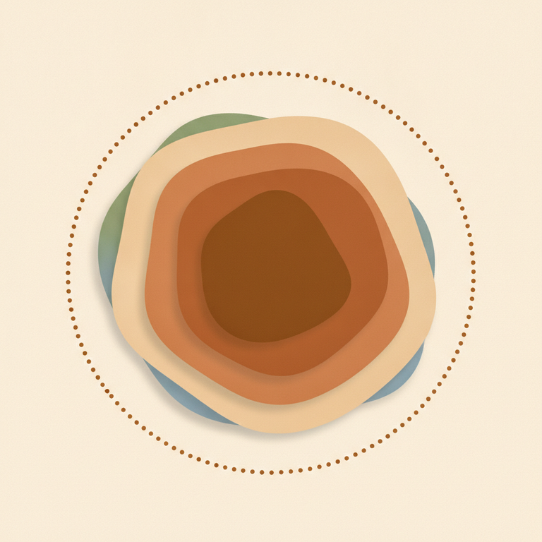

# 4. Théorie du self de Perls / Fonctions du self / Frontière contact.

## Le Self : un processus, pas une structure

La théorie du Self répond à une question simple en apparence, vertigineuse en pratique : **« Qui suis-je ? »**. Perls y apporte une réponse qui rompt radicalement avec la psychanalyse classique de son époque. Là où Freud décrit l'appareil psychique comme une **structure figée** — le Ça, le Moi, le Surmoi, des instances stables qu'il s'agit de rendre conscientes — Perls affirme que le **Self est un processus psychique**, un « événement dynamique, en mouvement », jamais figé, jamais achevé.

Le texte fondateur *Gestalt Therapy* (Perls, Hefferline, Goodman, 1951) formule cette définition avec une grande précision : **« Nous appellerons Self le système de contact à tous les instants. Le Self est la frontière-contact en action ; son activité est de former figures et fonds. »** Le Self n'est donc pas un lieu que l'on visite ni un contenant que l'on remplit : c'est une activité, celle-là même qui se joue au contact de l'environnement, instant après instant.

Le même texte introduit une nuance importante entre Self et **Moi** : « Le Moi est l'unité intégratrice, l'unité de synthèse, c'est l'artiste de la vie. Ce n'est qu'un petit facteur dans l'interaction totale organisme/environnement, mais c'est à lui que revient le rôle crucial de découvrir et de fournir les significations qui nous permettent de croître. » Le Moi est donc la partie du Self qui choisit, articule, donne du sens — l'agent qui tient la plume dans l'histoire en train de s'écrire.

Cette conception a une conséquence clinique directe : puisque le Self est un processus relationnel, toute rencontre met en présence **deux selfs qui se rencontrent**, chacun se déployant de façon singulière et unique selon l'autre qu'il a en face de lui. Le self de chacun a un impact différent sur le self de l'autre — ce qui explique qu'on ne « soit » jamais tout à fait la même personne selon qui l'on a en face de soi.

## Les trois fonctions du Self

Pour rendre ce processus observable et travaillable en thérapie, la Gestalt distingue trois **fonctions** du Self, comme trois façons différentes dont il s'exerce.

*La frontière du Self est représentée en pointillé : une structure ouverte et fermée à la fois, qui laisse passer — jamais une paroi étanche.*

Ce schéma illustre bien la nature du Self : un cercle dont le contour n'est pas un trait plein mais une ligne pointillée, qui laisse passer — à la fois ouverte et fermée. C'est cette structure poreuse qui permet au Self de rester un processus en mouvement plutôt qu'une structure figée.

### La fonction Ça

La fonction **Ça** est la partie la plus inconsciente de nous-mêmes. Elle contient tout ce qui a trait au corps, au monde émotionnel — ressenti, émotions, sexualité — et aux besoins organiques bruts, comme la faim. C'est la source de l'émergence immédiate : la synthèse pédagogique contemporaine du site gestalt.fr la résume ainsi, le Ça est la « dimension inconsciente — sensations corporelles, émotions, désirs — qui contient les besoins profonds et les mémoires émotionnelles de l'enfance ». En formation, la formule retenue est plus directe encore : **« Sensation = ça émerge »**. Le corps, dit-on, est littéralement « noyé dans le Ça ».

### La fonction Je

La fonction **Je** est la partie qui pense, agit et décide — la plus consciente des trois. C'est elle qui reçoit ce qui émerge du Ça et qui choisit quoi en faire : « avec ce qui émerge du Ça, le Je va agir, qui décide ». L'exemple donné en formation est celui de la sensibilité à l'injustice : une émotion surgit du Ça, et c'est le Je qui décide comment y répondre. Le Je régule aussi ce qui se passe à la frontière-contact — c'est lui qui, en définitive, tranche entre prendre et ne pas prendre ce qui vient de l'environnement.

### La fonction Personnalité

La fonction **Personnalité** est la vision que l'on a de soi-même, avec ses aspects positifs et négatifs — ce que l'on sait de soi, mais aussi l'image que l'on a des autres et des représentations sociales plus larges (« des idées de ce que sont les hommes, les femmes »). C'est l'espace où l'on a assimilé des expériences qui permettent de parler de soi ; en formation, elle est comparée à **une bibliothèque** : un lieu où s'enregistrent, se classent et s'organisent les expériences qui nous constituent. C'est aussi dans cette fonction que se rangent nos **croyances**. Contrairement au Ça et au Je, plus mouvants, la Personnalité est décrite comme une fonction relativement **stable** — une ressource, « ce que je sais de moi ». Une référence à **Jung** et à son concept de « Persona » a été faite en formation pour souligner qu'une personnalité a plusieurs facettes, et que le risque est de s'enfermer dans une seule d'entre elles, un seul rôle.

> ⚠️ Piège QCM : dans le cycle du contact, la **Sensation vient du Ça**, la **prise de conscience appartient au Je**. Une confusion fréquente est d'attribuer la prise de conscience au Ça — c'est l'inverse : le Ça produit l'émergence brute, le Je en prend conscience et décide.

> ⚠️ Piège QCM : les **Gestalts inachevées se logent dans le Self, plus précisément dans le Ça** — ce sont des expériences relationnelles restées non digérées, non métabolisées, qui n'ont pas pu être traitées. Elles ne sont pas statiques : elles sont énergétiques et cherchent sans cesse à se relancer, un peu comme « une pièce de théâtre rejouée avec de nouveaux acteurs adultes ».

## Chronologie développementale des trois fonctions

Les trois fonctions n'apparaissent pas toutes en même temps chez l'enfant. Entre 0 et 6 mois, le nourrisson est constamment dans le **Ça** : ses besoins organiques bruts s'expriment sans filtre, et seul l'environnement peut y répondre. Puis le **Je** s'élabore tout doucement — un bébé qui apprend, par exemple, à pleurer plus fort pour obtenir son biberon plus vite exerce déjà une forme de Je naissant. Enfin la **Personnalité** s'établit, en capitalisant sur les expériences passées, cristallisant peu à peu un « je dois être ».

Cette chronologie éclaire un mécanisme clinique important : quand un bébé pleure pour sa tétine sans être entendu, il vit une frustration qui s'imprime à la fois dans le Ça (l'émotion, l'angoisse) et dans la Personnalité (l'expérience qui s'emmagasine). L'enfant s'ajuste alors à son environnement — un **ajustement créateur**, une véritable solution de survie intelligente sur le moment. Le risque survient si cette solution se fige à l'âge adulte : elle devient alors une croyance limitative, un **ajustement conservateur** rigide qui continue de se reproduire bien après que la situation d'origine a disparu. (Ce mécanisme d'ajustement créateur/conservateur est développé plus en détail dans le thème consacré à la page blanche.)

## La frontière-contact

Le Self, avons-nous dit, est « la frontière-contact en action ». Il faut donc s'arrêter sur ce concept central : la **frontière-contact** est le lieu où l'organisme — l'individu — rencontre son environnement.

Le texte fondateur *Gestalt Therapy* (1951) en donne une définition d'une grande finesse, qu'il vaut la peine de citer en détail : la frontière-contact **« ne sépare pas »** l'organisme de son environnement — elle **« limite l'organisme, le contient et le protège »**, tout en le mettant en lien avec l'environnement. Elle n'est pas tant une partie de l'organisme qu'**« essentiellement l'organe d'une relation particulière entre l'organisme et l'environnement »**. Et cette relation particulière, précise le texte, **c'est la croissance**.

Une synthèse pédagogique contemporaine (gestalt.fr) reprend cette idée dans une langue plus imagée : « la frontière-contact est cet endroit très vivant où vous rencontrez le monde » — une zone **sensible et dynamique**, plutôt qu'une barrière rigide. Elle évalue en continu ce qui arrive : ce qui convient, ce qui représente une menace, comment réagir. Quand elle fonctionne avec souplesse, elle permet un lien authentique avec l'environnement sans que la personne ne s'y perde ; une citation de cette même source résume bien l'enjeu clinique : « quand cette frontière fonctionne avec fluidité, vous vivez pleinement ; quand elle se fige, la souffrance s'installe. »

**Le contact**, dans ce cadre, se définit comme la prise de conscience du champ ou la réponse motrice dans ce champ — c'est la prise de conscience de la **nouveauté assimilable**, et le comportement adopté envers elle ; c'est aussi, symétriquement, le rejet de la nouveauté inassimilable. Ce qui est diffus, immuable ou indifférent n'est tout simplement pas un objet de contact. D'où cette formule dense mais essentielle du texte fondateur : **« Tout contact est donc un ajustement créateur de l'organisme et de l'environnement »** — et à l'inverse, **« la psychopathologie, c'est l'étude de l'interruption, de l'inhibition ou d'autres accidents dans le cours de l'ajustement créateur »**. Quand la personne inhibe durablement le contact, son univers se déconnecte et devient peu à peu hallucinatoire, irréel.

Une frontière-contact peut aussi être **trop perméable** : elle laisse alors entrer indistinctement le bon et le mauvais, sans discernement — c'est précisément ce qui caractérise le mécanisme d'introjection (développé dans le thème sur les mécanismes de régulation du contact). À l'inverse, une frontière trop hermétique empêche tout contact réel avec l'environnement. Entre les deux se joue tout le travail thérapeutique : garder une frontière vivante, ni trop poreuse, ni trop fermée.

> ⚠️ Piège QCM : la frontière-contact n'est pas une **barrière** qui sépare l'individu du monde — elle est au contraire ce qui **relie** l'organisme à son environnement, tout en le protégeant. La confondre avec une simple cloison de séparation est une erreur fréquente.

## La neurosciences : la maison-cerveau

L'un des apports les plus originaux de la formation a été de faire correspondre la théorie du Self avec les découvertes des neurosciences contemporaines, à travers la métaphore de la **« maison-cerveau »**.

*Salon, sous-sol, salle des machines, salle de sport, thermostat, système d'alarme, suite parentale : autant de pièces de la maison qui symbolisent une structure du cerveau et son rôle.*

Dans cette métaphore, le **salon** correspond au cortex cérébral (le néocortex) : la pièce principale où l'on pense, lit, parle, apprend. Le **sous-sol**, pièce plus secrète, correspond à l'hippocampe, dans le système limbique : le lieu des souvenirs et des connaissances, crucial pour la formation de nouveaux souvenirs. La **salle des machines** représente le tronc cérébral, siège des fonctions automatiques — digérer, respirer, faire battre le cœur. La **salle de sport** correspond au cervelet, qui permet de bouger correctement, de garder l'équilibre, de coordonner les mouvements. Le **thermostat** de la maison, c'est l'hypothalamus : il régule la température, la faim, la soif, les cycles de sommeil, produit des hormones et intervient dans la régulation des émotions et des réponses au stress. Le **système d'alarme**, c'est l'amygdale : elle gère les émotions comme la peur ou la colère, et permet de réagir aux urgences. Enfin, la **suite parentale** correspond au cortex préfrontal (CPF) : le siège des fonctions exécutives — planification, organisation, flexibilité mentale, régulation de l'attention, inhibition des réponses impulsives. Fait notable, ce CPF ne **mature qu'à 25 ans**, et joue un rôle central dans la régulation émotionnelle.

Cette anatomie éclaire directement le travail thérapeutique en Gestalt : la formation avance que la pratique développe précisément le cortex préfrontal, à travers quatre leviers — la **mentalisation de l'acte**, la **régulation des émotions et du comportement social**, le **contrôle des impulsions**, et la **prise de décision juste**. Autrement dit, exercer le Self, c'est littéralement muscler le cerveau qui permet de mieux se réguler.

### Correspondance entre les fonctions du Self et le cerveau

La formation établit une correspondance directe entre les trois fonctions du Self et les grandes structures cérébrales : la **fonction Ça** correspond au système limbique (siège des émotions et de la mémoire affective) ; la **fonction Je** correspond à la régulation portée par le cortex préfrontal ; la **fonction Personnalité** correspond à l'interaction entre ces structures dans la durée. Cette correspondance donne tout son sens à la formule retenue en formation : **« on prend des décisions en fonction de qui on est »** — la décision (Je/CPF) est toujours colorée par l'histoire accumulée (Personnalité) et par ce qui émerge du corps et des émotions (Ça/système limbique).

Deux autres notions viennent enrichir ce tableau : la **plasticité cérébrale**, qui désigne la capacité du cerveau à se remodeler tout au long de la vie — il est malléable, et l'on peut influencer sa structure et son fonctionnement par ses pensées, ses actions et ses relations ; et la **neurogenèse**, la capacité à produire de nouveaux neurones, possible même chez les personnes âgées, favorisée par l'apprentissage et la stimulation mentale. Les relations et interactions sociales positives et nourrissantes favorisent justement cette croissance du cerveau — un argument neuroscientifique direct en faveur du travail relationnel proposé par la Gestalt.

## Exemple vécu en formation

Un outil concret permet de repérer, dans sa propre vie, la solidité de sa frontière-contact : la **grille d'évaluation de la communication**, croisant trois registres (parler de soi, de ses secteurs de vie, de ses idées) et trois niveaux — **superficiel** (mécanisme de défense, on reste au pré-contact, une image à donner plutôt qu'un vrai contact), **partiel** (on masque ses émotions négatives, on cloisonne son Self) et **libre et authentique** (on passe du « parler de » au « parler à », avec la capacité de se réguler). Se situer sur cette grille, pour chaque secteur de sa vie, est une manière très concrète de sentir où sa propre frontière-contact est trop fermée, trop ouverte, ou vivante.

## En lien avec d'autres notions

La théorie du Self ne se comprend pleinement qu'en lien avec la théorie du champ, qui décrit le terrain plus large — organisme et environnement — sur lequel se joue la frontière-contact ; et avec les mécanismes de régulation du contact, qui détaillent précisément comment le Je gère, à cette frontière, ce qu'il laisse entrer ou sortir.

## Sources

- [theorie-self-frontiere-contact-phg.md](../sources/theorie-self-frontiere-contact-phg.md) — synthèse du chapitre 1 de *Gestalt Therapy* (Perls, Hefferline, Goodman, 1951) par Claudia Gaulé, [EPG Gestalt](https://www.epg-gestalt.fr/media/PHG_chap1_Claudia%20Gaulé.pdf)
- [gestalt.fr — La théorie du Self selon la Gestalt](https://gestalt.fr/la-theorie-du-self-selon-la-gestalt/)
- [gestalt.fr — La frontière-contact, votre lien avec le monde](https://gestalt.fr/frontiere-contact-en-gestalt-votre-lien-avec-le-monde/)
- [Cairn.info — La question de Self](https://www.cairn.info/revue-cahiers-de-gestalt-therapie-2009-2-page-127.htm)
- Programme officiel IFAS — École Humaniste de Gestalt (voir `docs/sources/ifas-programme-officiel.md`)
