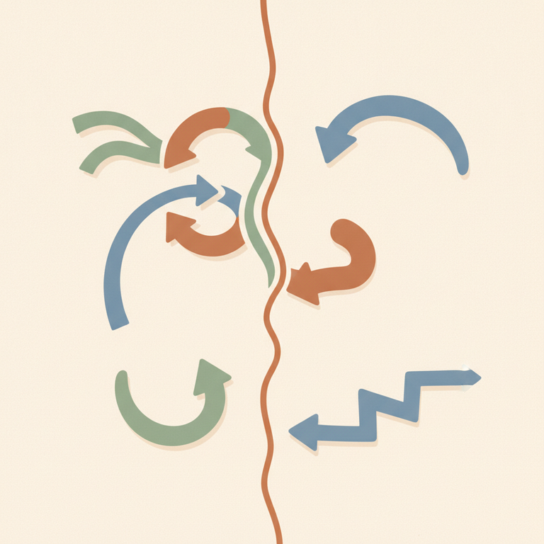

# 8. Les mécanismes de régulation du contact.

## D'anciens « mécanismes de défense » à des mécanismes de régulation

En psychanalyse classique, on parle de **mécanismes de défense** : des stratégies inconscientes qui protègent le psychisme d'un contenu jugé menaçant. La Gestalt reprend cette intuition clinique mais la reformule autrement, et ce changement de vocabulaire n'est pas cosmétique. En formation, la formule est explicite : « Anciennement mécanisme de défense » devient, en Gestalt, **« mécanisme de régulation du contact »**.

La différence clé tient en une phrase : il n'existe pas, en Gestalt, de « bons » ou de « mauvais » mécanismes — la distinction essentielle est que **l'un est conscient, l'autre est inconscient**. Un même mécanisme — la confluence, par exemple — peut être une ressource saine et choisie dans un contexte donné, et devenir un problème s'il se fige et s'exerce hors de toute conscience, de façon rigide et permanente. Erving et Miriam Polster, dans leur ouvrage *Gestalt Therapy Integrated*, insistent sur ce même point : ces mécanismes se sont développés comme des façons de faire face aux situations de la vie, et possèdent donc, structurellement, des qualités positives autant que des aspects problématiques.

Ces mécanismes se jouent tous au même endroit : la **frontière-contact**, ce lieu vivant où l'organisme rencontre son environnement (voir la théorie du self pour son étude complète). La question centrale posée en formation est simple : **« Comment on agit sur ces contacts ? »** — la réponse, précisément, ce sont ces mécanismes.

*Chaque mécanisme règle différemment ce qui passe, ou ne passe pas, entre l'organisme et son environnement.*

## Les mécanismes un par un

### La confluence

Dans la **confluence**, on laisse sa frontière-contact perméable à l'autre : on se laisse toucher, on ressent plus fortement ce que l'autre vit. C'est un **mécanisme adaptatif nécessaire et sain** — sans confluence, il n'y a pas d'empathie possible. Le risque apparaît quand elle devient permanente : une véritable **fusion de l'un dans l'autre**, où l'on « s'oublie ». Un thérapeute qui reste en confluence continue avec son client ne peut plus proposer de saine confrontation, faute de tout conflit possible entre les deux positions.

Un exercice de formation illustre bien la confluence saine : accepter d'aller dans le sens de l'autre — le type de vacances souhaité par un proche, par exemple — et se laisser toucher par ce choix même s'il n'est pas notre préférence spontanée. C'est, littéralement, « mettre de côté le fait d'être adulte » un instant, pour se laisser porter.

### L'égotisme

L'**égotisme** est presque l'inverse de la confluence : l'externe ne touche jamais l'interne, la frontière-contact se referme. Comme le décrit une ressource en ligne spécialisée, l'égotisme est « une sorte de barrière ultime entre soi et l'environnement » — rien n'entre, rien ne sort, par peur de lâcher prise et de perdre le contrôle. Ce mécanisme peut être une **saine protection ponctuelle** : l'enjeu clinique n'est pas sa présence en soi, mais sa durée — est-il occasionnel ou devenu un mode de fonctionnement permanent ? L'exemple donné en formation : quelqu'un qui, en écoutant, pense à autre chose, coupe la parole ou ramène systématiquement la conversation à lui-même.

### La projection

La **projection** consiste à croire l'interne dans l'externe : quelque chose qui nous appartient en propre est perçu comme venant de l'autre — « ça part de mon interne et ça va vers toi ». Dans la relation thérapeutique, le client projette fréquemment des éléments sur son thérapeute. La formation distingue deux formes : la **projection pure**, et la **projection de soi vers l'autre**, où l'on donne un peu plus de place à l'autre « parce que c'est bon pour lui, et ça devient bon pour moi » — une variante plus généreuse, orientée vers la relation plutôt que vers la simple confusion des frontières.

### L'introjection

L'**introjection** consiste à faire entrer massivement l'autre — l'environnement — dans son interne, **sans discernement**. L'exemple classique donné en formation : « T'es un garçon, les garçons ne pleurent pas ! » — une règle reçue de l'extérieur, avalée telle quelle, sans avoir été digérée ni questionnée. Une synthèse pédagogique (gestalt.fr) précise que ce mécanisme correspond à une frontière-contact trop perméable, qui ne fait pas le tri entre ce qui convient à l'organisme et ce qui ne lui convient pas — on absorbe le bon comme le mauvais. Un exercice classique de formation consiste à retrouver, dans sa propre histoire, une phrase précise dont on a été « introjecté ».

### La rétroflexion

La **rétroflexion** consiste à garder dans son interne ce qui, en toute justesse, devrait aller vers l'externe : être tout proche de dire quelque chose — un désir, un « je t'aime » — et finalement le garder pour soi, alors que le moment et le contexte s'y prêtaient. La formation souligne, dans le contexte des buts de la communication, que ce mécanisme correspond au « Retenir » (à l'opposé du « Donner ») et rappelle un point clinique fort : le **silence est un facteur de risque**, aussi bien dans le couple que dans le développement de l'enfant.

### La déflexion

La **déflexion** existe sous deux formes bien distinctes, qu'il faut savoir différencier. La **déflexion externe** consiste à décharger sur une personne B ce qui aurait dû sortir vers une personne A — détourner l'impact d'une émotion vers une cible qui n'est pas la bonne. La **déflexion interne**, à l'inverse, est une **saine déflexion** : on apprend à dévier consciemment la trajectoire d'une émotion ou d'une réaction, de façon créatrice, pour se protéger ou différer un impact — c'est exactement ce que propose, en pratique, la boîte de transformation vue dans la théorie du champ : déposer consciemment un élément perturbateur pour ne pas le laisser occuper toute la frontière-contact à un moment inopportun.

### La proflection

La **proflection** est un mécanisme combiné, décrit en formation comme : « faire quelque chose pour la recevoir en retour » — une association de projection et de rétroflexion. Concrètement, cela consiste à donner à l'autre ce que l'on aimerait recevoir soi-même, en espérant un retour en miroir. Le risque, si ce mécanisme se rigidifie, est une forme de lassitude relationnelle : être toujours dans l'attente d'un retour, sans jamais le demander directement.

## Sain ou névrotique : une question de degré

Selon Perls, cinq mécanismes constituent le socle historique de la régulation du contact — confluence, introjection, projection, rétroflexion, déflexion — auxquels les développements ultérieurs de l'école ont ajouté l'**égotisme** et la **proflection**. C'est d'ailleurs très précisément ce qu'ont fait Erving et Miriam Polster dans *Gestalt Therapy Integrated* : ils ont ajouté la déflexion comme cinquième mécanisme aux quatre premiers déjà identifiés (confluence, introjection, projection, rétroflexion), affinant ainsi la description clinique des interruptions du cycle de l'expérience.

Ces mécanismes sont **sains** tant qu'ils permettent à la personne de conserver son intégrité et son équilibre face aux sollicitations de l'environnement ; ils deviennent **névrotiques et invalidants** lorsqu'ils se chronicisent, se rigidifient et s'exercent hors de toute conscience. C'est très exactement la même idée que la distinction conscient/inconscient déjà posée en formation.

> ⚠️ Piège QCM : le programme officiel de l'IFAS ne retient que **six** mécanismes de régulation du contact — confluence, égotisme, projection, introjection, rétroflexion, déflexion. La **proflection**, bien qu'enseignée et pertinente cliniquement, n'apparaît pas dans cette liste officielle restreinte : à distinguer si une question QCM porte sur la liste « officielle » précise.

> ⚠️ Piège QCM : ne pas confondre la déflexion externe (décharger sur la mauvaise personne, mécanisme à repérer et travailler) avec la déflexion interne, présentée comme une **saine** déflexion, un usage créatif et conscient de ce même mouvement.

## La souveraineté du Je et l'axe de lumière

Face à ce qui vient de l'environnement, la formation propose une posture de fond : rester ouvert, en présence, en contact réel avec l'autre — mais choisir de ne pas prendre systématiquement ce qui vient vers soi, que ce soit bon ou mauvais. Face à quelque chose de massif ou toxique, l'enjeu n'est pas de fermer la frontière-contact (ce serait de l'égotisme), mais de **rester dans le contact tout en choisissant de ne pas prendre** — une nuance fine entre présence et absorption.

Cette posture s'accompagne d'une intentionnalité que la formation nomme l'**axe de lumière** : l'intention du praticien de rester orienté vers la part la plus lumineuse de la situation, plutôt que de se laisser happer par ce qui est le plus sombre ou le plus difficile chez l'autre.

## Exemple vécu en formation

Le module « Expression » (Week-end 5) a été l'occasion d'un exercice d'intégration collective : chaque participant était invité à repérer, dans sa propre communication du moment, quels mécanismes de régulation il reconnaissait chez lui — confluence dans telle relation, égotisme dans telle autre, rétroflexion sur tel sujet resté non-dit. Ce partage a permis de vérifier concrètement, sur des situations vécues en direct pendant le stage, à quel point ces mécanismes ne sont ni bons ni mauvais en eux-mêmes : ils dépendent entièrement du contexte et de leur caractère plus ou moins conscient.

## En lien avec d'autres notions

Les mécanismes de régulation du contact prennent tout leur sens à la lumière de la théorie du self et de sa frontière-contact, qu'ils viennent réguler très concrètement ; ils s'articulent aussi étroitement avec les niveaux de communication bienveillante, puisque c'est souvent au moment de communiquer que ces mécanismes se donnent le plus clairement à voir.

## Sources

- [theorie-self-frontiere-contact-phg.md](../sources/theorie-self-frontiere-contact-phg.md) — synthèse du chapitre 1 de *Gestalt Therapy* (Perls, Hefferline, Goodman, 1951)
- [gestalt.fr — La frontière-contact, votre lien avec le monde](https://gestalt.fr/frontiere-contact-en-gestalt-votre-lien-avec-le-monde/)
- [psychotherapie-gestalt-paris.com — Les mécanismes de régulation du contact en Gestalt-thérapie](https://psychotherapie-gestalt-paris.com/mecanismes-defense-gestalt/)
- [therapeute-gestalt.net — L'égotisme en Gestalt-thérapie, comprendre le besoin de contrôle](https://www.therapeute-gestalt.net/gestalt-article-interruption-cycle-contact-egotisme.php)
- Erving et Miriam Polster, *Gestalt Therapy Integrated: Contours of Theory and Practice* (1973) — synthèse via [gestalttherapythoughts.blogspot.com](https://gestalttherapythoughts.blogspot.com/2014/10/gestalt-therapy-integrated-erving-and.html) et [Gestalt-thérapie — Wikipédia](https://fr.wikipedia.org/wiki/Gestalt-th%C3%A9rapie)
- Programme officiel IFAS — École Humaniste de Gestalt (voir `docs/sources/ifas-programme-officiel.md`)
