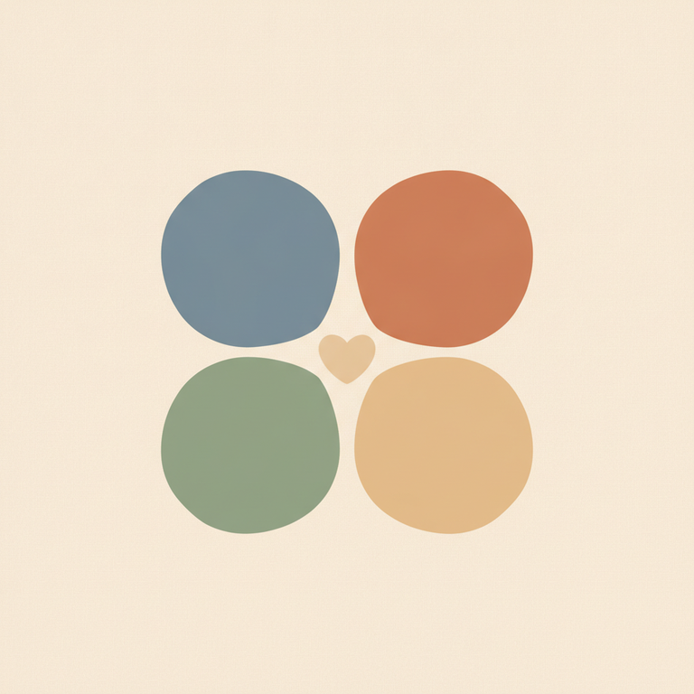

# 9. Les 4 champs thérapeutiques

Ce modèle est enseigné au dernier week-end du Cycle 1, celui de la Confiance, comme un outil pour situer très concrètement de quoi parle un client à un instant donné — et pour éviter au thérapeute de se perdre entre le récit de la séance, la mémoire de la relation, la vie réelle du client et son histoire d'enfance. L'idée centrale : à chaque instant, la parole du client se situe dans l'un de ces quatre champs, et le savoir aide à choisir la bonne manière d'intervenir.

*Les 4 champs s'organisent autour de deux axes — le lieu (ici / pas ici, dans le cabinet ou hors du cabinet) et le temps (maintenant / pas maintenant) — pour cartographier de quoi parle réellement le client à un instant T.*

## Champ 1 — Ici et maintenant

C'est ce qui se passe **entre le client et le thérapeute**, dans le contact, le lien, le cadre même de la séance en train de se dérouler. C'est le champ **central** du travail thérapeutique en Gestalt, cohérent avec l'attention permanente portée à l'ici et maintenant dans toute la méthode : ce qui se joue réellement de thérapeutique, c'est l'expérience présente de la relation, pas seulement ce que le client raconte à son sujet.

## Champ 2 — Ici mais pas maintenant

C'est l'histoire de la relation thérapeutique elle-même — par exemple, ce qui s'est passé lors d'une séance précédente. On peut le résumer comme **« la mémoire de la relation thérapeutique »** : ce que le thérapeute a noté, gardé en tête, et qu'il choisira d'aborder à un autre moment si cela sert le travail en cours.

Un point important souligné en formation : **le travail de thérapie consiste précisément à relier le Champ 1 et le Champ 2** — c'est-à-dire à faire dialoguer l'expérience présente avec la mémoire de tout ce qui s'est construit auparavant dans le lien thérapeutique.

## Champ 3 — Maintenant mais pas ici

C'est la vraie vie contemporaine du client, hors du cabinet : son travail, sa vie de couple, ses relations, ses soucis quotidiens. La formation le formule sans détour : **« les clients viennent en thérapie pour parler de leur Champ 3 »**. C'est en effet le champ le plus spontanément investi par la parole du client — normal, puisque c'est ce qui le préoccupe concrètement au quotidien.

## Champ 4 — Passé développemental

C'est l'enfance, l'adolescence, les expériences, les relations familiales, les souvenirs : « il parle de son histoire ». Le programme officiel précise un point de vigilance essentiel : **le Champ 4 n'est pas objectif**. Il n'est pas une photographie figée du passé, mais une reconstruction toujours en mouvement, qui évolue au cours de la thérapie elle-même. En Gestalt-thérapie intégrative, la posture est de **croire le client** — pas de vérifier l'exactitude factuelle du souvenir, mais de considérer que revisiter le passé et lui donner du sens atténue les souffrances qui y sont attachées.

## Pourquoi ce découpage est utile

⚠️ **Piège QCM classique** : confondre le Champ 3 (la vie actuelle, hors cabinet) et le Champ 4 (le passé développemental) — les deux parlent du client « ailleurs » que dans l'ici-et-maintenant de la séance, mais l'un est présent (maintenant) et l'autre passé. Le repère à retenir : Champ 3 = maintenant + pas ici ; Champ 4 = ni maintenant, ni ici (le passé).

Autre nuance à ne pas perdre : le Champ 2 n'est pas la vie du client en dehors du cabinet, mais bien la mémoire de **la relation thérapeutique** — un champ souvent négligé dans les représentations spontanées du métier, alors qu'il est jugé central pour la continuité du travail.

La consigne de synthèse retenue en formation résume bien l'enjeu pratique : « les définir, et les ramener à l'ici et maintenant ». Autrement dit, quel que soit le champ dans lequel parle le client à un instant donné, le travail du thérapeute consiste toujours, à un moment ou un autre, à reconnecter ce contenu à ce qui se vit ici et maintenant dans la relation — le Champ 1 restant le lieu où le changement devient réellement observable et agissant.

## Exemple concret

Un client raconte une dispute avec son conjoint survenue la veille (Champ 3) ; en l'écoutant, le thérapeute remarque que le client baisse les yeux et parle plus bas, comme il l'avait déjà fait la séance précédente en évoquant sa mère (Champ 2, la mémoire de la relation) ; le thérapeute choisit de nommer ce qu'il observe dans l'instant présent — « je remarque que votre voix change, là, maintenant, en me racontant ça » (retour au Champ 1) — ce qui peut alors ouvrir, si le client s'y sent prêt, sur un lien avec une scène d'enfance plus ancienne (Champ 4). C'est ce mouvement de va-et-vient entre les quatre champs, toujours ramené au présent de la séance, qui constitue le geste thérapeutique.

## Une origine à préciser avec prudence

⚠️ Il faut être honnête sur ce point : la filiation académique précise de ce découpage en 4 champs n'est pas totalement établie par les sources consultées. La terminologie et la structure ressemblent fortement aux apports de la **Gestalt-thérapie intégrative** telle que développée en France par des auteurs comme Serge Ginger, Chantal Masquelier-Savatier et Jean-Marie Robine (École Parisienne de Gestalt), qui ont largement formalisé la théorie de champ appliquée à la clinique gestaltiste après Perls. Le programme officiel de l'IFAS présente ce modèle comme faisant partie intégrante de sa propre théorie des champs thérapeutiques, mais rien n'indique avec certitude s'il s'agit d'une création propre à l'école d'Arnaud Sebal ou d'une reprise d'un modèle plus large de la Gestalt-thérapie intégrative française. À vérifier si une source plus précise est trouvée par la suite.

---

Ce modèle des 4 champs prend tout son sens une fois articulé avec la théorie du champ organisme-environnement, dont il est une déclinaison clinique, et avec la théorie du Self, puisque c'est bien le Self du client qui se manifeste différemment selon le champ dans lequel il s'exprime.

## Sources

- Notes de cours, week-end 6 (Confiance).
- [Programme officiel IFAS — École Humaniste de Gestalt](https://www.gestalt.fr/wp-content/uploads/2018/03/programme-cycle_1.pdf) (`docs/sources/ifas-programme-officiel.md`), définition officielle des 4 champs.
- [Comprendre et pratiquer la Gestalt-thérapie — Chantal Masquelier-Savatier, Jean-Marie Robine (Dunod)](https://www.dunod.com/sciences-humaines-et-sociales/comprendre-et-pratiquer-gestalt-therapie-une-demarche-stimulant-1)
- [Gestalt-thérapie — Wikipédia](https://fr.wikipedia.org/wiki/Gestalt-th%C3%A9rapie)
