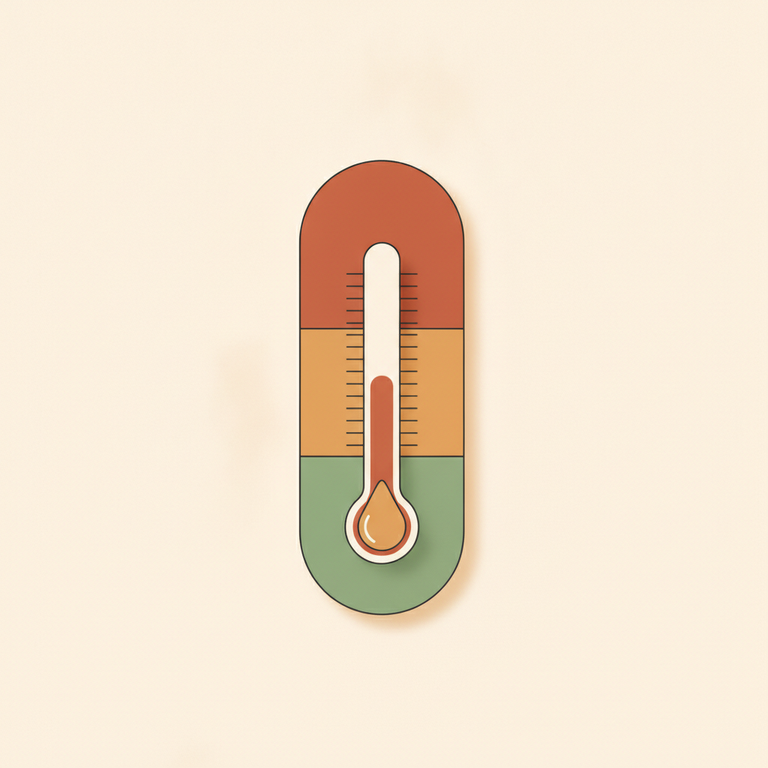
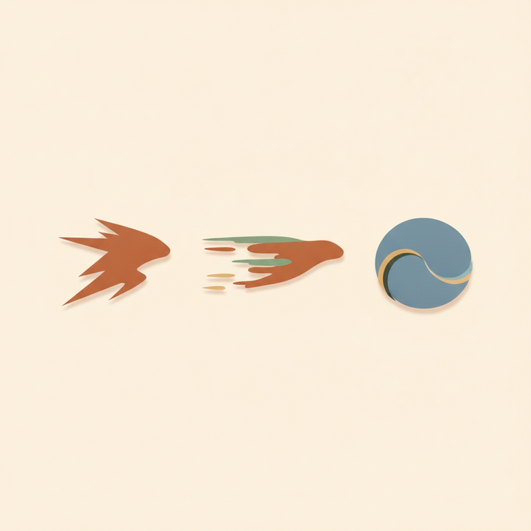
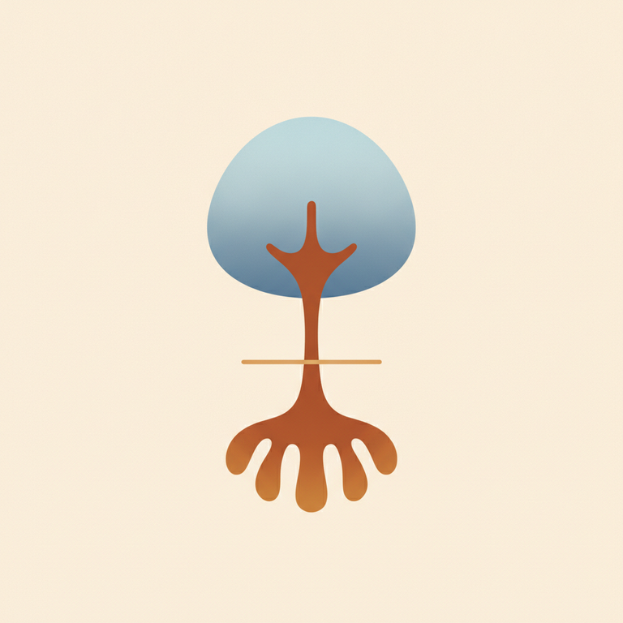

# 10. La vision gestaltiste du stress

Le week-end « Vivre » s'ouvre sur une question simple et directe : « Comment vous sentez-vous vivant, vivante, sur 100 % ? » — 100 % correspondant à une pleine présence à la vie, 1 % à la pure survie. Cette échelle donne le ton de tout le module : **VIVRE, c'est un état de grâce** ; à l'opposé, l'organisme peut se retrouver comme en apnée, en mode survie — c'est cet état-là que l'on appelle le **stress**.

Un point de méthode est répété avec insistance en formation : le stress doit rester une réponse **ponctuelle**. Il ne doit surtout pas être banalisé, ni devenir inconscient et chronique — un rappel qui prend tout son sens à la lumière des 3 phases décrites plus loin.

> « La vie, ce n'est pas d'attendre que l'orage passe, mais d'apprendre à danser sous la pluie. » — citation de Sénèque reprise en ouverture du module, pour poser l'intention du travail : apprendre à identifier le stress (interne/externe, ponctuel/chronique) et à réguler ses émotions pour garder le bien-être quels que soient les événements de la vie.

## Stresseur et stress : une distinction à ne jamais confondre

⚠️ **Piège QCM central de ce thème** : le **stresseur** et le **stress** ne sont pas la même chose.

- Le **stresseur** est l'événement, la personne, l'exigence ou la situation — perçu comme un agresseur au sens large, ponctuel ou chronique, petit ou grand.
- Le **stress** est **la réponse** au stresseur : ce qui est vécu en nous, dans notre corps et nos émotions.

Faire cette distinction, ce n'est pas un exercice de vocabulaire : c'est ce qui permet un premier pas de recul et de mouvement. Si je confonds les deux, je reste piégé dans l'idée que « c'est l'autre/la situation qui me fait ça » ; si je les distingue, je peux commencer à agir sur ma propre réponse, même quand je n'ai aucune prise sur le stresseur.

Cette distinction n'est pas une invention gestaltiste : elle vient tout droit de la physiologie du stress, développée par le médecin **Hans Selye** (endocrinologue d'origine austro-hongroise, ayant fait carrière au Canada), dans son article fondateur *A Syndrome Produced by Diverse Nocuous Agents*, publié dans la revue *Nature* en 1936. Selye y décrit, sur des rats soumis à des agressions très diverses (froid, choc chirurgical, intoxication...), un syndrome de réponse **identique quelle que soit la nature de l'agression** — ce qu'il appellera plus tard le **Syndrome Général d'Adaptation (SGA)**. La Gestalt reprend et prolonge cette base médicale en l'articulant à la posture thérapeutique et à la théorie du champ.

## Les 3 phases du stress selon Selye

*Les trois phases s'enchaînent si le stresseur persiste ou se répète sans que l'organisme ne parvienne à revenir à l'équilibre.*

### 1ʳᵉ phase — Alarme

L'hormone dominante est l'**adrénaline**, active environ une heure maximum. Elle stimule les 5 sens : concentration accrue, mémoire vive, force musculaire décuplée. Trois réactions instinctives sont possibles à ce stade : **fuite, combat, ou sidération** (« faire le mort »). C'est une réponse adaptative saine : le système nerveux met en route des mécanismes physiologiques permettant au corps de réagir, en inhibant au passage les fonctions non essentielles à la survie immédiate (appétit, soif...).

### 2ᵉ phase — Résistance

L'hormone dominante devient le **cortisol**, dans une logique d'**homéostasie** : le corps s'efforce de maintenir un équilibre malgré la persistance du stresseur. L'adrénaline continue elle aussi d'augmenter. Cette phase se caractérise par ce que le cours appelle **« la qualité empêchée »** : la personne a les compétences nécessaires, mais n'arrive plus à les exercer, comme entravée par la tension accumulée. Si cette phase se prolonge ou se répète trop souvent, l'organisme finit par ne plus pouvoir lutter, et bascule dans la phase suivante.

### 3ᵉ phase — Épuisement

L'organisme, sollicité trop longtemps, ne parvient plus à s'équilibrer. Les symptômes se multiplient : dépression, anxiété, maladie, troubles de la mémoire, repli sur soi, angoisse, douleurs physiques. Le versant **psychosomatique** est large : fatigue, migraines, troubles du sommeil et digestifs, coliques, ulcères, irritabilité, conduites addictives, troubles du comportement alimentaire. Cortisol et adrénaline restent alors élevés simultanément, terrain propice au burn-out et à une vulnérabilité accrue aux maladies infectieuses.

⚠️ **Piège QCM** : le **stress aigu** (ponctuel) est adapté et normal — c'est une réponse saine de l'organisme. Le **stress chronique**, lui, est pathologique. Ne pas confondre les deux niveaux de gravité : ce n'est pas le stress en soi qui pose problème, c'est sa banalisation et sa chronicisation.

## Le baromètre du stress

*Trois zones pour s'auto-évaluer à tout instant : où en suis-je, là, maintenant ?*

- **Orange — Stress/Détresse** : saturation, absence de réponse adaptée ; on n'est pas en pleine jouissance de ses capacités.
- **Bleu — Mobilisation/Eustress** : une énergie saine, un ajustement dynamique à l'environnement.
- **Vert — Détente/Homéostasie** : l'état de référence au repos, résumé par la triade « pensée juste, parole juste, acte juste ».

⚠️ Nuance importante soulignée en formation : la zone verte, c'est la **détente**, pas la **relaxation** — on peut très bien être dans la détente tout en restant actif et mobilisé. Ce n'est pas un état passif de repli, mais un état de disponibilité pleine.

L'idée du baromètre sert aussi à comparer des profils énergétiques types : le profil « personne stressée », où la zone orange domine très largement et la détente se réduit parfois à son strict minimum (« détente au coucher » seulement) ; et le profil « praticien Gestalt », où la zone verte domine et reste stable, la mobilisation demeure disponible, et un stress résiduel subsiste sans envahir le reste. Le praticien doit stabiliser ce profil vert pour pouvoir offrir, en séance, un ancrage sécurisant à son client — une forme de **co-régulation**.

## Les 3F et la théorie polyvagale de Porges

*Fight et Flight sont pilotés par le système nerveux orthosympathique ; Freeze relève du système parasympathique.*

Les 3 réactions instinctives de la phase d'alarme se répartissent en deux circuits nerveux : **Fight** (combat) et **Flight** (fuite) sont pilotés par le nerf **orthosympathique**, qui coupe les besoins secondaires (digestion, sommeil...) pour mobiliser toute l'énergie vers l'action ; **Freeze** (sidération, figement) relève, lui, du nerf **parasympathique**.

C'est ici qu'un deuxième emprunt théorique mérite d'être signalé explicitement : ce que les notes de cours appellent le « nerf vague » et rattachent au figement renvoie directement à la **théorie polyvagale** du chercheur américain **Stephen Porges**, introduite en 1994 et publiée en 1995 dans la revue *Psychophysiology*. Porges y montre que le nerf vague — le nerf le plus long du corps humain — n'est pas un circuit unique, mais se compose de deux branches distinctes aux fonctions opposées : la branche **vagale ventrale**, associée à la sécurité et à l'engagement social (ce que Porges nomme le « système d'engagement social », une véritable connexion viscérale entre le visage et le cœur), et la branche **vagale dorsale**, activée dans les situations de menace extrême, qui mène à l'immobilisation, au figement, voire à la dissociation. C'est cette branche dorsale, plus archaïque, qui est à l'œuvre dans le Freeze. La théorie polyvagale distingue ainsi trois circuits hiérarchisés : le vagal ventral (sécurité), le sympathique (fuite/combat), et le vagal dorsal (figement) — une lecture nettement plus fine de la physiologie du stress que ne le suggère la seule opposition « orthosympathique versus parasympathique » évoquée en cours. En Gestalt, cette base physiologique est reprise pour justifier une chose : la volonté ne peut pas intervenir directement sur ces réactions — ce qui permet aussi de déculpabiliser (« ce n'est pas toi qui décides » de figer ou de fuir).

## Typologie et manifestations du stress

Les stresseurs identifiés en formation couvrent des champs très concrets de la vie quotidienne : la vie professionnelle (pression de résultats, surcharge, manque de personnel, hiérarchie incohérente ou harcelante), la vie affective (divergences de couple, incohérences entre mots et actes, enfants stresseurs), les problèmes matériels (argent, transports), et des données proprement existentielles — tout ce qui met face à la finitude : maladie, perte d'un proche, propre mort, perte d'autonomie, nécessité de faire des choix.

Le corps traduit ce stress de deux manières : au niveau **neuro-végétatif** (variations de cortisol et d'adrénaline, pression artérielle et rythme cardiaque en hausse, palpitations, tremblements, transpiration) et par la **somatisation physique** (crispation musculaire, douleurs abdominales, oppression thoracique, blocage respiratoire, tête vide, vertiges, insomnies, migraines).

## Verticalité et horizontalité : l'axe

*L'image de l'arbre : ancré dans la terre (verticalité, contact avec soi) et relié au ciel (ouverture, créativité), tout en étendant ses branches vers l'environnement (horizontalité, contact avec l'autre).*

L'axe vertical est comparé à la colonne vertébrale d'un arbre : besoin de contact et d'ancrage à la terre, et besoin de reliance au ciel — ouverture, vastitude, intuition, créativité. La loi de nutrition de cet axe est simple : s'il n'est pas nourri, il s'atrophie ; plus il est nourri, plus il gagne en force. Plus on est ancré dans son axe, plus on est conscient et capable de ressentir pleinement.

Perpendiculairement à cet axe se déploie l'horizontalité : le contact avec l'autre, avec l'environnement. Les **temps de retrait** permettent de revenir régulièrement à sa verticalité — se recentrer sur ses propres besoins, ses valeurs, ses limites — avant de repartir vers le contact horizontal avec le monde. C'est une respiration entre soi et l'autre, indispensable pour ne pas s'épuiser dans la relation.

## Sortir du stress : responsabilité et retour au calme

La formation pose un principe fort : **« je suis responsable de mon état, les stresseurs ne sont pas responsables de mon état intérieur »**. On n'a pas de pouvoir sur l'extérieur, mais on a du pouvoir sur soi — le premier axe de travail consiste donc à agir sur son propre interne, plutôt que de partir du principe que l'autre sait consciemment ce qu'il nous fait subir.

Le retour au calme s'appuie sur trois gestes simples : prendre conscience de son baromètre (où est-ce que j'en suis, là, maintenant ?), intégrer des moments de respiration, et revenir à l'ici et maintenant — faire une chose à la fois, être présent à ce que l'on fait, finir autant que possible ses « gestalts quotidiennes » plutôt que de les laisser en suspens.

### Le protocole d'accompagnement du stress

Pour accompagner un client en situation de stress, la formation enseigne un protocole en 4 temps :

1. **Cadrage existentiel** : « Quelle situation te génère du stress et pourrait t'éloigner du 100 % de la vie ? »
2. **Exploration phénoménologique et somatique** : « Dis-moi ce que ça provoque dans ton corps ? » (tension, respiration, douleur).
3. **Reformulation** : « J'entends que tu... »
4. **Présence et co-régulation** : « Je suis là », « On respire ensemble », « C'est OK ».

Ce protocole ne fonctionne que si le praticien travaille lui-même sa propre verticalité, faute de quoi il risque de basculer dans la confluence (se laisser envahir par le stress du client) ou dans son propre épuisement.

## Exemple concret : l'exercice des « 2 camemberts »

Un exercice pratique du week-end illustre concrètement ce protocole, en miroir entre client et praticien. Le **client** dessine ses deux « camemberts » (cercles répartis en parts), revient à son corps, parle de son projet, et réfléchit à ce qui pourrait faire baisser son baromètre — des moments et horaires réels de respiration, des exemples concrets tirés de son quotidien (travail, maison). Le **praticien**, de son côté, aide la personne à voir comment incarner concrètement les trois points du retour au calme, en prenant lui-même le temps de se centrer et de respirer, sans se précipiter à proposer des interventions « sauvatrices » — en somme, en apprenant à **rester**, simplement présent, plutôt qu'à agir trop vite pour combler le vide.

---

La vision gestaltiste du stress prend tout son sens une fois reliée à la posture de valeurs et déontologie de la formation — le praticien doit d'abord stabiliser son propre baromètre avant de pouvoir en offrir un à son client — et à la théorie du champ, puisque les stresseurs eux-mêmes ne prennent sens que dans l'interaction entre l'organisme et son environnement.

## Sources

- Notes de cours, week-end 3 (Vivre).
- [Programme officiel IFAS — École Humaniste de Gestalt](https://www.gestalt.fr/wp-content/uploads/2018/03/programme-cycle_1.pdf) (`docs/sources/ifas-programme-officiel.md`), formulations officielles du stress, du baromètre et de l'intentionnalité.
- Hans Selye, [« A Syndrome Produced by Diverse Nocuous Agents »](https://www.nature.com/articles/138032a0), *Nature*, vol. 138, 1936, p. 32.
- Stephen W. Porges, théorie polyvagale (1994/1995) — [« La théorie polyvagale et l'hypnose »](https://hypnose-bouscat.fr/la-theorie-polyvagale-et-lhypnose/) ; [« Le nerf vague et la théorie polyvagale du Dr Stephen Porges »](https://shop.methode-bechacq.fr/dossier/le-nerf-vague-et-la-theorie-polyvagale-du-docteur-stephen-porges/)
