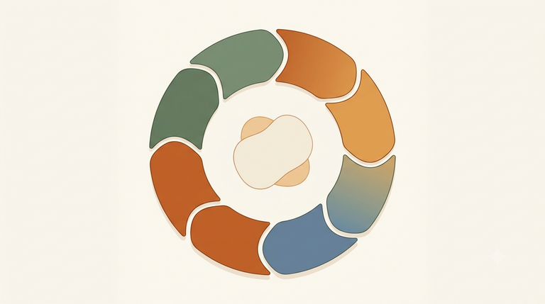

# 11. Le cycle du contact.

## Un concept formalisé par Joseph Zinker

Le cycle du contact — souvent appelé en formation « cycle de Zinker » — décrit le parcours naturel que suit un organisme pour répondre à un besoin, vivre une émotion pleinement, ou entrer en relation avec son environnement. Si les fondateurs de la Gestalt, Perls, Hefferline et Goodman, avaient déjà posé les bases théoriques du contact et de l'ajustement créateur dans *Gestalt Therapy* (1951), c'est **Joseph Zinker**, formé au Gestalt Institute de Cleveland (où furent également formés Miriam et Erving Polster), qui a formalisé et popularisé ce cycle en étapes dans son ouvrage devenu une référence du champ, *Creative Process in Gestalt Therapy* (1977) — élu livre de l'année par le magazine *Psychology Today* à sa sortie. C'est dans les années 1970, avec Miriam Polster et Bill Warner, que ce « cycle de l'expérience » (ou cycle awareness-excitation-contact) prend sa forme la plus connue.

## Le cycle, étape par étape

*Le cycle du contact : du retrait initial (vide créateur) jusqu'au retrait final, en passant par la sensation, la prise de conscience, la mobilisation de l'énergie, l'action, le contact, le désengagement et l'assimilation.*

Le cycle se lit comme une boucle qui se referme sur elle-même, prête à recommencer. Voici ses grandes étapes, dans l'ordre où elles s'enchaînent :

**Le Retrait**, point de départ du cycle, est aussi appelé le **« vide créateur »** : un état défini en formation comme « Soi avec soi ». Ce n'est pas un vide vain ni un état d'ennui, mais un espace fertile, disponible, à partir duquel une nouvelle expérience va pouvoir émerger.

Vient ensuite le **pré-contact**, phase la plus riche en sous-étapes : la **Sensation** apparaît d'abord — elle émerge du corps, de ce que la théorie du Self appelle la fonction **Ça** (le registre le plus inconscient de nous-même). Cette sensation est ensuite saisie par la **prise de conscience**, qui appartient à la fonction **Je** — la partie de nous qui pense et qui décide. Cette prise de conscience déclenche alors la **mobilisation de l'énergie**, l'organisme rassemblant ses ressources en vue d'agir.

L'**Action** proprement dite suit, mouvement concret vers ce qui pourrait satisfaire le besoin identifié.

Le sommet de la courbe est le **Contact** : l'expérience pleine, l'engagement direct avec l'environnement — le moment où l'on « digère » vraiment ce que l'on rencontre, en le déstructurant et en l'assimilant à soi.

Puis vient le **désengagement** — on se détache progressivement de l'objet du contact — suivi de l'**assimilation**, où l'expérience vécue est intégrée, transformée en ressource. Le cycle se referme alors en un nouveau **retrait**, qui n'est pas un retour au point de départ identique, mais un organisme légèrement changé par ce qu'il vient de vivre, disponible pour une nouvelle boucle.

⚠️ **Piège QCM** : bien retenir que la **Sensation vient du Ça**, tandis que la **prise de conscience appartient au Je**. C'est une association précise, souvent testée telle quelle : Ça → Sensation, Je → prise de conscience.

Selon les sources et les formulations, ce cycle est présenté de façon plus ou moins détaillée — parfois en cinq grandes phases (pré-contact, engagement, plein contact, désengagement, assimilation), parfois, comme en formation, en une séquence plus fine distinguant Retrait, Sensation, prise de conscience, mobilisation de l'énergie, Action, Contact, désengagement, Assimilation. Ce ne sont pas des versions contradictoires, mais des degrés de granularité différents d'un même mouvement.

## Le point le plus important : l'interruption possible

Le cycle du contact n'est jamais une mécanique garantie. **Une interruption est possible à n'importe quel moment du cycle** — c'est précisément là que se logent les Gestalts inachevées. Si, par exemple, la mobilisation de l'énergie ne débouche jamais sur une action (par peur, par interdit intériorisé, par manque de ressources), ou si le contact plein n'est jamais atteint, l'expérience reste en suspens. Elle continue alors de consommer de l'énergie en arrière-plan, comme une tension non résolue qui cherche, encore et encore, à se refermer — jusqu'à ce qu'elle trouve enfin l'occasion de se compléter, parfois des années plus tard, dans un tout autre contexte relationnel.

## Le lien avec la saine agressivité

Le cycle du contact est indissociable, en formation, de la notion de **saine agressivité**. Pour Perls, l'agressivité — bien distincte de la violence ou de la colère — est une **pulsion de vie** : c'est l'énergie qui pousse à aller vers l'environnement, à le pénétrer pour y trouver de quoi satisfaire ses besoins. Cette énergie est précisément celle que l'on retrouve dans la phase de **mobilisation de l'énergie** et d'**Action** du cycle : sans une saine agressivité, mobilisée et assumée, le mouvement vers le contact ne peut tout simplement pas se produire. Une personne qui inhibe systématiquement cette agressivité se retrouve bloquée avant même d'atteindre le contact — ce qui explique pourquoi ce concept est si étroitement associé au cycle dans les révisions du QCM.

## Le lien direct avec la définition même de la Gestalt

La toute première définition de la Gestalt donnée en formation prend tout son sens ici : la Gestalt s'intéresse à **« tout ce qui a un début et une fin »**. Le cycle du contact est très exactement la modélisation de ce début et de cette fin — de la sensation naissante jusqu'à l'assimilation qui clôt l'expérience. Une thérapie gestaltiste efficace se reconnaît d'ailleurs, selon le texte fondateur de 1951, à la qualité de cette Gestalt : « lorsque la figure est obscure, confuse, dépourvue de grâce et d'énergie, on peut être certain qu'il y a un manque de contact, un blocage, qu'un besoin organique vital n'est pas exprimé. » Une Gestalt réussie, à l'inverse, se traduit par « un mouvement gracieux et énergique, qui a un rythme et va jusqu'au bout » — l'image même d'un cycle du contact qui a pu se dérouler sans interruption majeure.

## Un exemple concret vécu en formation

Le cycle a été introduit en formation à travers des temps de partage très concrets : « Qu'est-ce que vous évoque ce concept ? », « Par rapport à vos objectifs, comment ça se passe pour vous ? ». Ce type de question invite chacun à repérer, dans sa propre vie, à quelle étape du cycle il a tendance à décrocher — telle personne mobilise beaucoup d'énergie mais n'ose jamais passer à l'action ; telle autre atteint le contact sans jamais réussir à s'en désengager et à assimiler ce qu'elle vient de vivre, restant comme suspendue dans l'expérience. Repérer sa propre « signature d'interruption » est l'un des grands objectifs pratiques de ce thème pour la suite du cursus.

## Liens avec d'autres thèmes

Le cycle du contact est au cœur de la théorie du Self, puisque ses étapes de pré-contact mobilisent directement les fonctions Ça et Je. Il est aussi la clé de lecture des Gestalts inachevées, qui naissent précisément des interruptions répétées du cycle, et il éclaire la distinction entre ajustement créateur et ajustement conservateur : un ajustement conservateur rigide correspond souvent à un cycle qui se referme toujours de la même manière, sans jamais laisser place à une issue nouvelle.

## Sources

- Notes de formation, Week-end 1 « Nouveau départ », Week-end 2 « Clarté », Week-end 6 « Confiance ».
- `docs/sources/theorie-self-frontiere-contact-phg.md` (résumé de *Gestalt Therapy*, Perls/Hefferline/Goodman, 1951)
- `docs/sources/ifas-programme-officiel.md` (schéma officiel du cycle de Zinker)
- [Herb Stevenson — Gestalt Cycle of Experience (chapitre sur le cycle de Zinker)](https://www.herbstevenson.com/chapters/gestalt-cycle-of-experience-chapter-2.php)
- [Al de Lacroix — Un peu de théorie, le cycle du contact gestaltiste](http://www.aldelacroix-gestalt.fr/un-peu-de-theorie-le-cycle-du-contact-gestaltiste/)
- [Joseph Zinker — Wikipedia](https://en.wikipedia.org/wiki/Joseph_Zinker)
